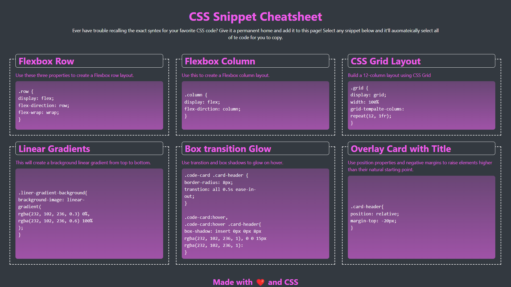
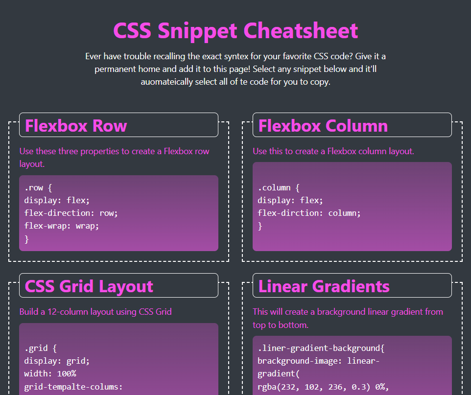
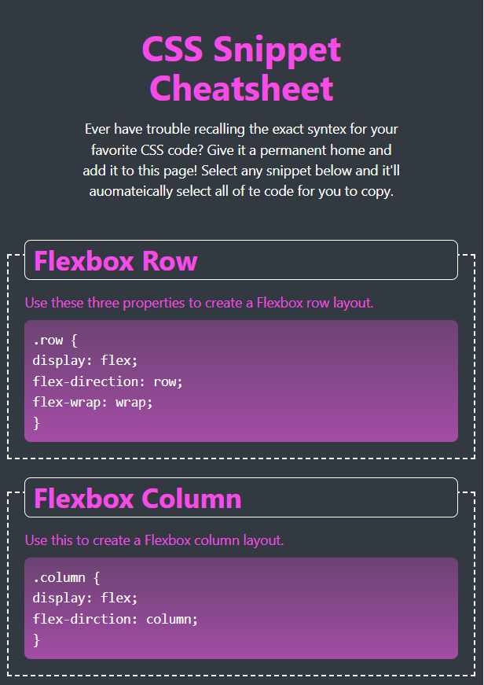

# Module-02 MiniProject: CSS Snippet Cheat Sheet

## Description
A webpage has been created that holds collection of CSS snippets.
- A responsive design that works with different screen sizes.
- Uses flexbox and media queries to create a responsive grid layout.
- Each CSS contains a card-like layout with the CSS syntax wrapped in an HTML element.
- Each CSS snippet can easily be highlighted for copying on clicking CSS user select property.
- Incorporates a back ground colour using CSS linear gradient function.
- Incorporates an animation using CSS transition property.

## Deployment
The webpage is deployed to GitHub pages. Use below link to visit the webpage: https://nileshpatel83.github.io/Module02-MiniProject/

## Screenshots
- At size 992 pixel and above, the page resembles as following:

- At size 768 pixel and above, the page resembles as following:

- At size less than 768 pixel and above, the page resembles as following:

## License
Please refer to the LICENSE in the repo.